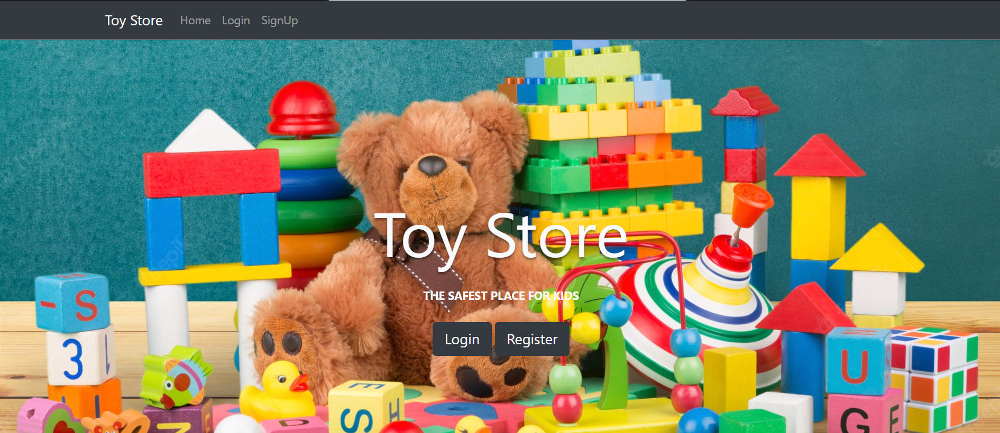

# Toy Jungle MVC - Capstone Project

An e-commerce web application for a toy store, built as part of a B.Tech capstone project using ASP.NET MVC, C#, and SQL Server.

## 🚀 Overview

**Toy Jungle MVC** provides a platform to browse and purchase toys online, featuring:

* **Product Catalog** with categories, search, and filtering
* **Shopping Cart** for adding/removing items
* **User Authentication** (register, login, logout)
* **Order Processing** with checkout and order history
* **Admin Panel** for managing products and orders

The application follows the **Model-View-Controller (MVC)** pattern for clean separation of concerns and maintainability.

---

## 📁 Repository Structure

```
.
├── .gitignore                     # Files and folders to ignore in Git
├── E_CommerceDB1.bak              # SQL Server database backup
├── Toy_Jungle/                    # SQL scripts or data access layer
├── ToyJungle_MVC/                 # ASP.NET MVC web application
│   ├── Controllers/               # MVC controllers
│   ├── Models/                    # Data models and Entity Framework classes
│   ├── Views/                     # Razor views (UI pages)
│   ├── Scripts/                   # JavaScript files
│   ├── Content/                   # CSS and static assets
│   └── ToyJungle_MVC.sln          # Visual Studio solution file
└── README.md                      # Project overview and instructions
```

---

## 🛠️ Prerequisites

* **Visual Studio 2019+** with ASP.NET workload
* **.NET Framework 4.7.2** (or higher)
* **SQL Server 2017+** (Express or Developer)

---

## ⚙️ Setup & Installation

1. **Clone the repository**

   ```bash
   git clone https://github.com/Sayyad2000/Capstone-Project.git
   cd Capstone-Project
   ```

2. **Restore the database**

   * Open **SQL Server Management Studio**
   * Right-click **Databases** → **Restore Database**
   * Select `E_CommerceDB1.bak` and complete restore

3. **Configure connection string**

   * In `ToyJungle_MVC/Web.config`, update the `<connectionStrings>` entry:

     ```xml
     <connectionStrings>
       <add name="ToyDb" connectionString="Server=YOUR_SERVER;Database=E_CommerceDB1;Trusted_Connection=True;" providerName="System.Data.SqlClient" />
     </connectionStrings>
     ```

4. **Open and run the solution**

   * Open `ToyJungle_MVC.sln` in Visual Studio
   * Build the solution (Ctrl+Shift+B)
   * Run with **IIS Express** (F5)
   * Navigate to `https://localhost:44300` (or assigned port)

---

## 🎯 Usage

* **Browse Products**: View lists, categories, and details
* **Search & Filter**: Find toys by name or category
* **User Actions**: Register, login, and manage profile
* **Cart & Checkout**: Add items to cart, place orders
* **Admin Panel**: Manage inventory and view orders (accessible at `/Admin`)

---

## 🧩 Technologies Used

* **ASP.NET MVC** for web application framework
* **C#** for backend logic
* **Entity Framework** for ORM and data access
* **SQL Server** for relational database
* **HTML5, CSS3, JavaScript** for frontend

---




## 📋 Contribution

Contributions are welcome! To contribute:

1. **Fork** this repo
2. **Create a feature branch** (`git checkout -b feature/YourFeature`)
3. **Commit your changes** (`git commit -m "Add feature"`)
4. **Push to branch** (`git push origin feature/YourFeature`)
5. **Open a Pull Request**

For major changes, please open an issue first to discuss your ideas.

---

## 📧 Contact

For questions or collaboration, reach out to:

* **Email**: [sayyad2000.com@gmail.com](mailto:sayyad2000.com@gmail.com)

---

## 📜 License

This project is for academic and educational purposes. All rights reserved.
